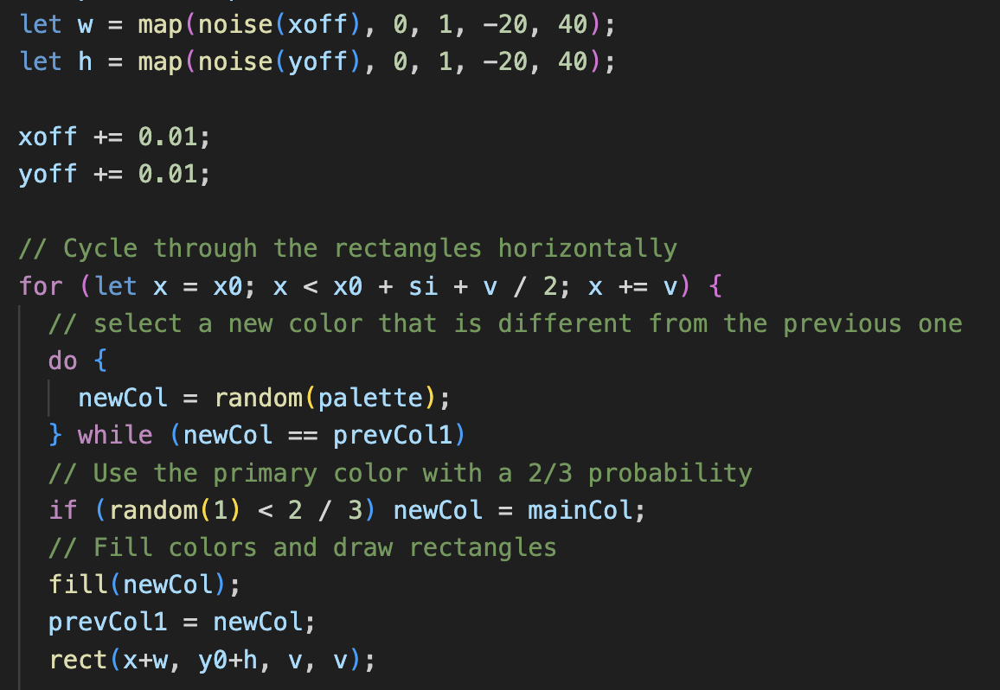
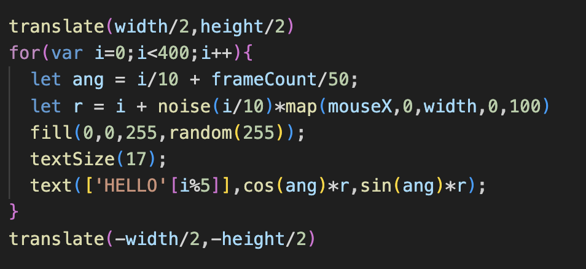

# wsha0495_9103_tut6

#### Functioning prototype
###### Perlin noise and randomness:Utilise Perlin noise AND random values or random seed to drive animation.
After running the program, the position of the rectangles is automatically varied according to the value of noise, a noise function is used to generate random widths and heights, and multiple rectangles in a row are drawn by looping. The color of each rectangle is chosen randomly and is different from the color of the previous rectangle. This creates a pattern of rectangles with random colors and sizes.

First, the code initializes three variables, prevCol1, prevCol2, and newCol, which are used to store the color values. Next, the code uses the noise function (noise) to generate two variables, w and h, which are used to determine the width and height of the rectangle. The noise function returns a random number between 0 and 1 based on the input xoff and yoff values and maps them to a range of -20 to 40 using the map function. xoff and yoff values are incremented by 0.01 after each loop. The code then draws a row of rectangles in a loop. The loop starts at x0 and ends at x0+si+v/2, increasing the value of v with each iteration.

In each iteration, the code selects a new color that is different from the previous one. It uses a do-while loop to ensure that the new color selected is not the same as prevCol1. If the randomly selected color is the same as prevCol1, a new color is selected again. This ensures that each rectangle has a different color. The code then applies the selected color to the rectangle using the fill function and draws the rectangle using the rect function. The drawing is done at (x+w, y0+h) with a width and height of v. The rectangle is then drawn using the rect function.

The for loop will loop 400 times, each time calculating an angle ang and a radius r. The angle ang varies as the number of loops i increases, and is also affected by frameCount, while the radius r is calculated based on the current number of loops i, the return value of the noise function noise(), and the position of the mouse on the X axis. Subsequently, the code will draw the characters in HELLO on the canvas using cos(ang)*r and sin(ang)*r as coordinates, with the color of the characters being blue and the transparency being random. The whole process creates a dynamic effect, with the text changing position and transparency as frameCount increases.

   
