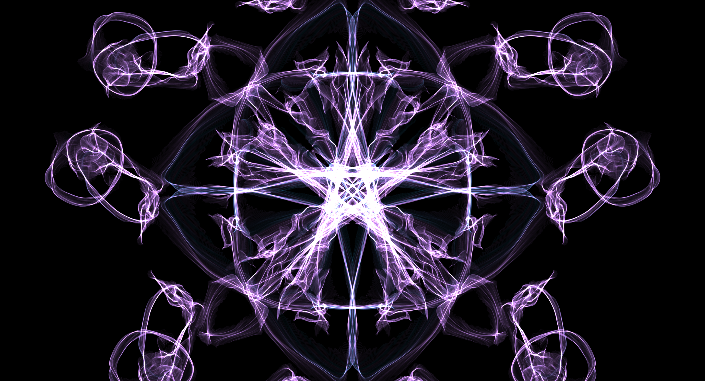
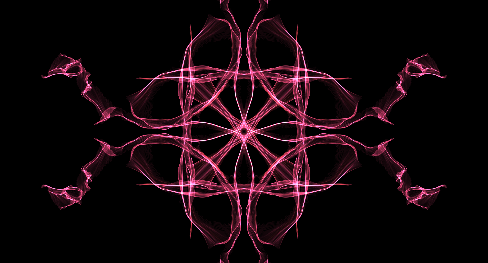
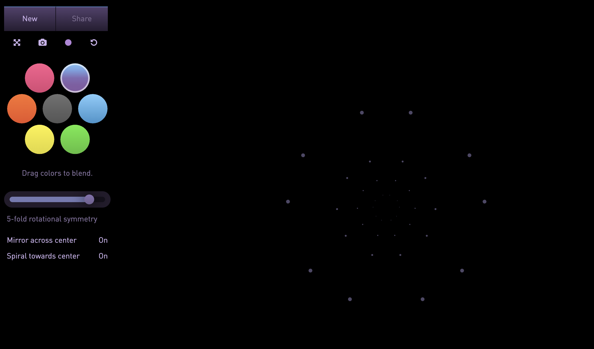
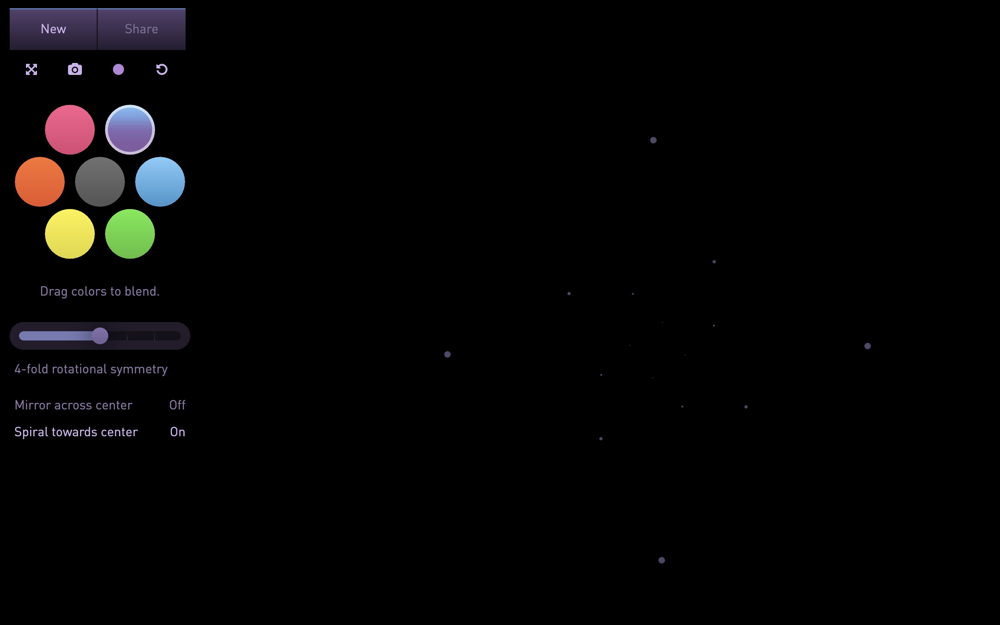
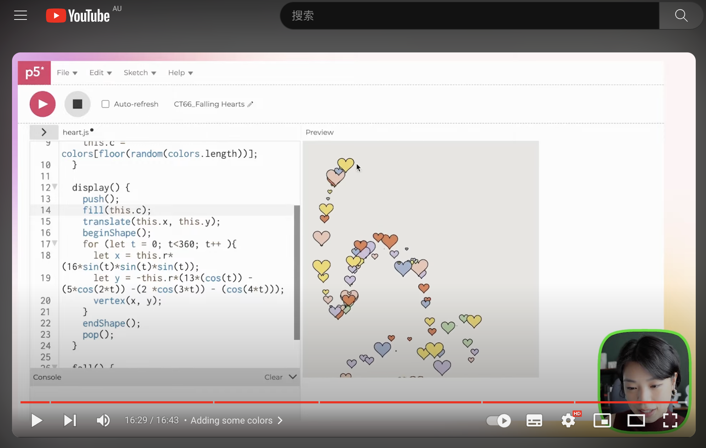

# wsha0495_9103_tut6

#### Part 1: Imaging Technique Inspiration 

I think mouse and keyboard interaction is very inspiring to me, and I was inspired by Yuri Vishnevsky's Silk. Silk is an interactive image generator that creates works by clicking and moving the mouse. The symmetrical form of mouse creation made me very interested and wanted to join the project. In Silk, you can change the symmetry of the image by changing the movement direction and trajectory of the mouse point, such as selecting the number of symmetry points. And I think this technology can produce high-quality works while ensuring aesthetics.

##### Silk     

[Silk Link](https://experiments.withgoogle.com/silk)

##### Mouse Point

[Experiments Link](http://weavesilk.com/)

#### Part 2: Coding Technique Exploration

In p5.js I found 'mouseDragged()' to implement the imaging technique I chose in the first part, 'mouse click movement'. The mouseDragged() function can capture the dragging action of the mouse and draw smooth, flowing lines on the canvas. Later, you can add other functional functions, such as color changes, line changes, and line texture changes. Create richer works based on 'mouseDragged()'.

##### p5.js--mouseDragged()
[mouseDragged() Link](https://p5js.org/reference/#/p5/mouseDragged)
##### YouTube--Falling Hearts 💕💕 

[YouTube Link](https://www.youtube.com/watch?v=zH3eH3hlGoo)